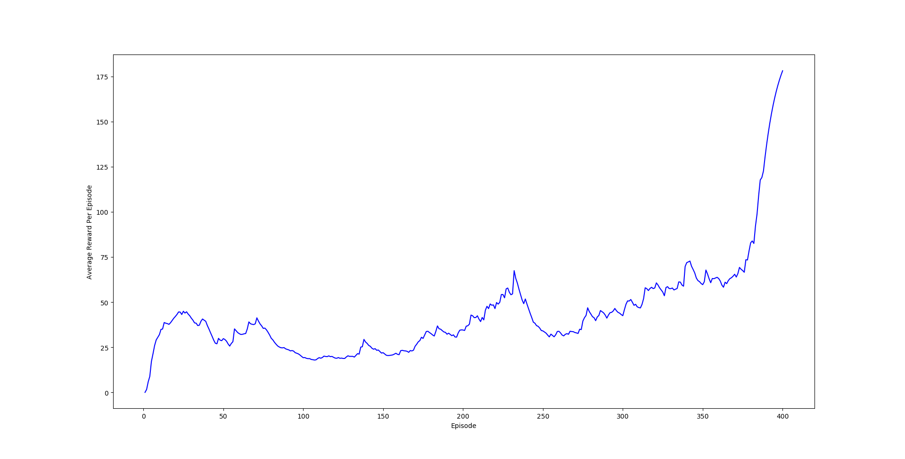
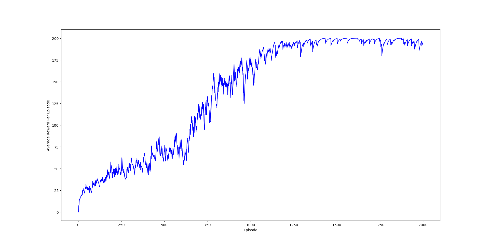

# Human-Level Control through Deep Reinforcement Learning

Tensorflow implementation of [Human-Level Control through Deep Reinforcement Learning](https://web.stanford.edu/class/psych209/Readings/MnihEtAlHassibis15NatureControlDeepRL.pdf).

## Summary

* DQN: Q-Learning but with a Deep Neural Network as a function approximator.
* Using a non-linear Deep Neural Network is powerful, but training is unstable if we apply it naively.
* Trick 1 - Experience Replay: Store experience (S, A, R, S_next) in a replay buffer and sample minibatches from it to train the network. This decorrelates the data and leads to better data efficiency. 
* Trick 2 - Target Network: Use a separate network to estimate the TD target. This target network has the same architecture as the function approximator but with frozen parameters. Every T steps (a hyperparameter) the parameters from the Q network are copied to the target network. This leads to more stable training because it keeps the target function fixed (for a while).
* By using a Convolutional Neural Network as the function approximator on raw pixels of Atari games where the score is the reward we can learn to play many of those games at human-like performance.
* Double DQN: Just like regular Q-Learning, DQN tends to overestimate values due to its max operation applied to both selecting and estimating actions. We get around this by using the Q network for selection and the target network for estimation when making updates.

## Requirements

- Python 3.5.3
- [OpenAI Gym](https://github.com/openai/gym)
- [Numpy](http://www.numpy.org/)
- [SciPy](http://www.scipy.org/install.html)
- [Matplotlib](https://matplotlib.org/) 
- [Scikit Learn](http://scikit-learn.org/stable/) 
- [TensorFlow](https://github.com/tensorflow/tensorflow/tree/r0.12)

## Results

Double DQN

Policy Gradients

